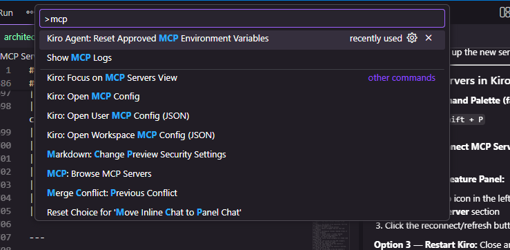

# Groww Review Analyser — Architecture

> **For agents reading this:** Each phase is a discrete, ordered unit of work. Complete one phase fully before starting the next. Every phase lists its exact inputs, outputs, tools to call, decisions to make, and failure handling. Follow the instructions literally.

---

## Key Design Decisions (read first)

| Decision | Choice | Reason |
|---|---|---|
| Review source | Play Store only | Simpler ingestion, single data shape, no App Store RSS pagination complexity |
| Review cap | **150 reviews max** | Keeps ingestion fast and well within Groq's free-tier rate limits |
| LLM provider | **Groq API** (`llama-3.3-70b-versatile`) | Free tier, 128k context window, ~500 tokens/sec — fast and generous |
| LLM input strategy | Send **text summaries only**, not full JSON objects | Cleaner prompts; avoids sending metadata the model doesn't need |
| Review filter | ≥ 7 words, English only, no emojis | Removes noise before it reaches the LLM |
| Delivery: Google Docs | Official Google Workspace remote MCP — `drivemcp.googleapis.com` | MCP-first, no hand-rolled REST |
| Delivery: Gmail | Official Google Workspace remote MCP — `gmailmcp.googleapis.com` | MCP-first, no hand-rolled REST |
| Google Doc format | Create as a plain-text file via Drive MCP `create_file` | Drive MCP exposes `create_file`; Docs-specific MCP is not yet GA |

---

## System Overview

```
┌──────────────────────────────────────────────────────────────────────┐
│                         PIPELINE (left → right)                      │
│                                                                      │
│  [PHASE 1]       [PHASE 2]       [PHASE 3]       [PHASE 4]          │
│  Ingest      →   Clean      →    Analyse     →   Deliver            │
│  Play Store       & Filter        & Write         via MCP           │
│  (≤150 reviews)                   Pulse           (Drive + Gmail)   │
└──────────────────────────────────────────────────────────────────────┘
```

**Total phases: 4**
**Execution order: strictly sequential — no phase may start until the previous one is complete.**

---

## Data Contract (shared across all phases)

Every review object passed between phases must conform to this schema:

```json
{
  "id": "string — unique identifier (hash of text+date if no native ID)",
  "store": "play_store",
  "rating": "integer 1–5",
  "title": "string | null",
  "text": "string — full review body",
  "date": "ISO 8601 date string — e.g. 2025-03-01",
  "theme": "string | null — populated in Phase 3"
}
```

**PII rule (enforced at every phase):** No field may contain a username, email address, device ID, reviewer name, or any other personally identifiable information. Strip or omit such fields at the point of ingestion.

---

## Phase 1 — Ingest Reviews

### Goal
Pull the most recent public Groww Play Store reviews, capped at 150, and produce a raw review list.

### Why 150?
Groq's free tier (`llama-3.3-70b-versatile`) has a 128k context window, so 150 reviews is well within limits. We cap at 150 to keep each run fast, predictable, and within Groq's free-tier rate limits (6,000 requests/day). After Phase 2 filtering, the actual count sent to the LLM will typically be lower.

### Inputs
| Input | Source | Notes |
|---|---|---|
| Play Store reviews | `google-play-scraper` npm package | Public, unauthenticated — within Play Store ToS |
| App ID | Constant: `com.nextbillion.groww` | Groww's Play Store package name |
| Review cap | Constant: `MAX_REVIEWS = 150` | Hard ceiling — stop fetching once reached |
| Sort order | `Sort.NEWEST` | Ensures we get the most recent reviews first |

### Steps (execute in order)
1. Import `google-play-scraper`. Call `reviews()` with:
   ```js
   gplay.reviews({
     appId: 'com.nextbillion.groww',
     lang: 'en',
     country: 'in',
     sort: gplay.Sort.NEWEST,
     num: 150,        // hard cap — do not exceed
     throttle: 10     // ms between requests — be polite
   })
   ```
2. Take only the first `MAX_REVIEWS` (150) results from the response. Discard the rest.
3. For each review, map fields to the Data Contract schema:
   - `id` → `review.id` (or `sha1(review.text + review.date)` if missing)
   - `store` → `"play_store"` (hardcoded)
   - `rating` → `review.score`
   - `title` → `review.title` or `null`
   - `text` → `review.text`
   - `date` → `review.date.toISOString().split('T')[0]`
   - `theme` → `null` (populated later)
4. Strip any PII fields (reviewer name, `userName`, `userImage`, `url`) — omit entirely.
5. Deduplicate by `id`.

### Output
```
raw_reviews: Review[]   // ≤ 150 Review objects, PII-free, Play Store only
```

### Acceptance criteria
- Array length between 1 and 150 inclusive.
- All objects conform to the Data Contract.
- No PII fields present (`userName`, `userImage`, `url` must not exist on any object).
- `store` field is `"play_store"` on every object.

### Failure handling
| Failure | Action |
|---|---|
| Network error | Retry up to 3 times with 2-second backoff, then halt with error message |
| Zero reviews returned | Halt — surface error: "No reviews found — check app ID and network" |
| Fewer than 10 reviews returned | Log a warning but continue — small sample is still valid |
| Malformed record | Skip it, log the index, continue with the rest |

---

## Phase 2 — Clean and Filter

### Goal
Produce a clean, analysis-ready review list by removing noise, enforcing language and quality rules, and normalising text before it reaches the LLM.

### Inputs
```
raw_reviews: Review[]   // output of Phase 1
```

### Steps (execute in this exact order)

**Step 1 — Remove duplicates**
Deduplicate on `text` field: exact match after lowercasing and trimming whitespace. Keep the first occurrence, drop the rest.

**Step 2 — Strip emojis**
Remove all emoji characters from `text` and `title`. Use this Unicode range regex to strip them:
```js
text = text.replace(
  /[\u{1F300}-\u{1FFFF}\u{2600}-\u{26FF}\u{2700}-\u{27BF}\u{FE00}-\u{FEFF}\u{1F000}-\u{1F02F}\u{1F0A0}-\u{1F0FF}\u{1F100}-\u{1F1FF}\u{1F200}-\u{1F2FF}\u{1F900}-\u{1F9FF}\u{1FA00}-\u{1FA6F}\u{1FA70}-\u{1FAFF}]/gu,
  ''
).trim()
```
After stripping, re-trim and collapse multiple spaces into one.

**Step 3 — Language filter (English only)**
Drop any review that is not in English. Detection method:
- Use the `franc` npm package (`franc-min` for a lighter build) to detect language.
- Keep the review only if `franc(text) === 'eng'`.
- If `franc` returns `'und'` (undetermined) AND the text is very short (< 20 chars), keep it — it's likely a short English phrase that can't be detected.
- If `franc` is unavailable, fall back to a stop-word heuristic: check if the text contains at least one of `['the','is','are','was','not','app','and','but','for','with','this','have','has','my','it']`. If none match, drop the review.

**Step 4 — Minimum word count filter**
Count words by splitting on whitespace: `words = text.trim().split(/\s+/)`.
Drop any review where `words.length < 7`. (Keeps reviews with at least 7 words — more signal than a 6-word minimum, avoids single-word or very short noise.)

**Step 5 — Normalise text**
- Lowercase the entire `text`.
- Collapse multiple spaces/newlines/tabs into a single space.
- Trim leading and trailing whitespace.
- Store result back in `text`.

**Step 6 — Truncate long reviews**
If `text` exceeds 300 characters after normalisation, truncate to 300 characters at the nearest word boundary and append `…`. This keeps LLM input lean without losing the core message.

**Step 7 — Rating sanity check**
If `rating` is not an integer between 1 and 5, set it to `null`. Do not drop the review.

### Filtering order matters
```
raw_reviews
  → deduplicate          (remove exact copies)
  → strip emojis         (clean text before language detection)
  → language filter      (English only — franc or stop-word fallback)
  → word count filter    (≥ 7 words)
  → normalise            (lowercase, collapse whitespace)
  → truncate             (≤ 300 chars)
  → rating check         (null out bad ratings)
= clean_reviews
```

### Output
```
clean_reviews: Review[]   // filtered, English-only, emoji-free, ≥7 words, normalised, text ≤ 300 chars
```

### Acceptance criteria
- No duplicate texts.
- No emojis in any `text` or `title` field.
- All reviews are English (franc confidence or stop-word match).
- Every review has `text` with at least 7 words.
- Every `text` is ≤ 300 characters.
- All texts are lowercase and whitespace-normalised.

### Failure handling
| Failure | Action |
|---|---|
| `clean_reviews` is empty after filtering | Halt — surface error: "All reviews were filtered out — check language filter or review quality" |
| `franc` package not installed | Fall back to stop-word heuristic (Step 3 fallback), log a warning |
| Fewer than 10 reviews survive filtering | Log a warning: "Low review count after filtering: N reviews" — continue anyway |

---

## Phase 3 — Analyse and Write Pulse

### Goal
Cluster reviews into themes, select the top 3, pick representative quotes, generate 3 action ideas, and assemble the final pulse document text.

### Inputs
```
clean_reviews: Review[]   // output of Phase 2
```

### ⚠️ LLM Input Rules (apply to every sub-phase that calls the LLM)
- **Never send full Review objects to the LLM.** Send only the `text` field (and `id` where needed for clustering).
- **Never send more than 100 review texts in a single LLM call.** If `clean_reviews.length > 100`, split into two batches and merge results. (Groq's 128k window can handle more, but batching keeps responses clean and avoids hitting per-minute token rate limits on the free tier.)
- **Model to use:** `llama-3.3-70b-versatile` via Groq API.
- **API base URL:** `https://api.groq.com/openai/v1` (OpenAI-compatible endpoint).
- **Auth:** `Authorization: Bearer <GROQ_API_KEY>` header.
- **Temperature:** `0.2` for clustering and action ideas (low = more consistent, less hallucination).
- **Always instruct the model to return only JSON or a numbered list** — no preamble, no markdown fences, no explanation. Free models tend to wrap output in prose; explicit instructions prevent this.

---

### Sub-phase 3A — Theme Clustering

#### Steps
1. Build the LLM input: extract only `{ id, text }` from each review. Do not include rating, date, store, or title.
2. If `clean_reviews.length > 100`, split into two halves. Run the clustering prompt on each half separately, then merge the resulting theme lists by combining `review_ids` for matching theme names.
3. Send to the LLM:

```
SYSTEM:
You are a product analyst. Cluster app reviews into themes.

RULES:
- Produce 2 to 5 themes. Never more than 5.
- Theme names: 1–3 words. Examples: "KYC Verification", "Payment Failures", "App Performance".
- Assign every review to exactly one theme.
- Return ONLY a JSON array. No explanation. No markdown. No extra text.
- Format: [{ "theme": "<name>", "review_ids": ["<id>", ...] }]
- Do not invent themes not supported by the reviews.

USER:
Reviews (id + text only):
[
  { "id": "abc1", "text": "kyc is stuck for 3 days..." },
  { "id": "abc2", "text": "payment failed twice..." },
  ...
]

Return the JSON array now.
```

4. Parse the LLM response as JSON. If parsing fails, retry once with an explicit instruction: "Return only valid JSON, no other text."
5. Validate:
   - Between 2 and 5 theme objects returned.
   - Every review ID from the input appears in exactly one theme's `review_ids`.
   - No theme has zero reviews.
6. Write the assigned `theme` value back onto each Review object in `clean_reviews`.

#### Output
```
themed_reviews: Review[]        // each review now has theme field populated
theme_groups: ThemeGroup[]      // [{ theme: string, reviews: Review[] }]
```

---

### Sub-phase 3B — Rank and Select Top 3

#### Steps (no LLM call — pure computation)
1. Sort `theme_groups` by `reviews.length` descending.
2. Take the top 3. Call them `top_themes`.
3. For each theme in `top_themes`, compute:
   - `review_count` — number of reviews in the theme.
   - `avg_rating` — mean of all non-null `rating` values (round to 1 decimal).
   - `low_rating_pct` — percentage of reviews with `rating ≤ 2` (round to nearest integer).

#### Output
```
top_themes: [
  {
    theme: string,
    review_count: number,
    avg_rating: number,
    low_rating_pct: number,
    reviews: Review[]
  },
  // × 3
]
```

---

### Sub-phase 3C — Select Quotes

#### Steps (no LLM call — pure logic)
1. For each of the 3 top themes, select 1 representative quote:
   - Prefer reviews with `rating ≤ 2`.
   - Among those, pick the review whose `text` is between 30 and 150 characters.
   - If no review meets both criteria, relax: pick the shortest `text` in the theme.
2. Truncate to 150 characters maximum. Append `…` if truncated.
3. Verify the quote contains no PII patterns (email regex, phone number regex). If it does, pick the next candidate.

#### Output
```
quotes: [
  { theme: string, text: string },  // × 3, one per top theme
]
```

---

### Sub-phase 3D — Generate Action Ideas

#### Steps
1. Build a compact LLM input — do NOT send full review texts. Send only the theme summary and quotes:

```
SYSTEM:
You are a senior product manager at a fintech app.

RULES:
- Generate exactly 3 action ideas.
- Each action must be concrete and specific — not generic advice.
- Each action must be grounded in one of the themes below.
- Format: numbered list. Each item: one sentence, ≤ 25 words.
- Return only the numbered list. No preamble, no explanation.

USER:
Top themes this week:
1. KYC Verification — 42 reviews | Avg rating: 1.8★ | 78% rated ≤2★
2. Payment Failures — 31 reviews | Avg rating: 2.1★ | 65% rated ≤2★
3. App Performance — 28 reviews | Avg rating: 2.4★ | 50% rated ≤2★

User quotes:
[KYC Verification] "kyc stuck for 3 days, no response from support…"
[Payment Failures] "payment deducted but not reflected in portfolio…"
[App Performance] "app crashes every time i open the mutual funds tab…"

Generate 3 action ideas now.
```

2. Parse the response into an array of 3 strings. Strip leading numbering (`1.`, `2.`, `3.`).

#### Output
```
action_ideas: string[]   // exactly 3 items
```

---

### Sub-phase 3E — Assemble Pulse Document

#### Steps (no LLM call — string assembly)
1. Compose the pulse text using this exact template. Fill in all `<placeholders>`:

```
GROWW APP — WEEKLY REVIEW PULSE
Week of: <MONDAY of current week — DD MMM YYYY>
Reviews analysed: <clean_reviews.length>
Source: Google Play Store | Latest <clean_reviews.length> reviews

━━━━━━━━━━━━━━━━━━━━━━━━━━━━━━━━━━━━━━━━
TOP THEMES THIS WEEK
━━━━━━━━━━━━━━━━━━━━━━━━━━━━━━━━━━━━━━━━

1. <Theme 1> — <count> reviews | Avg: <avg>★ | <pct>% rated ≤2★
2. <Theme 2> — <count> reviews | Avg: <avg>★ | <pct>% rated ≤2★
3. <Theme 3> — <count> reviews | Avg: <avg>★ | <pct>% rated ≤2★

━━━━━━━━━━━━━━━━━━━━━━━━━━━━━━━━━━━━━━━━
WHAT USERS ARE SAYING (verbatim, anonymised)
━━━━━━━━━━━━━━━━━━━━━━━━━━━━━━━━━━━━━━━━

[<Theme 1>] "<quote 1>"
[<Theme 2>] "<quote 2>"
[<Theme 3>] "<quote 3>"

━━━━━━━━━━━━━━━━━━━━━━━━━━━━━━━━━━━━━━━━
ACTION IDEAS
━━━━━━━━━━━━━━━━━━━━━━━━━━━━━━━━━━━━━━━━

1. <action idea 1>
2. <action idea 2>
3. <action idea 3>

━━━━━━━━━━━━━━━━━━━━━━━━━━━━━━━━━━━━━━━━
Generated by Groww Review Analyser.
```

2. Count words in the pulse body (exclude separator lines). If > 250 words, shorten action ideas to ≤ 20 words each.

#### Output
```
pulse_text: string   // final formatted pulse, ≤ 250 words
```

---

### Failure handling (Phase 3)
| Failure | Action |
|---|---|
| LLM returns invalid JSON | Retry once with explicit JSON-only instruction; if still invalid, halt |
| LLM returns > 5 themes | Take only the first 5, re-run ranking |
| LLM returns < 2 themes | Retry once; if still < 2, halt with error |
| LLM returns < 3 action ideas | Retry once; if still < 3, pad with: "Investigate <theme> further with the product team" |
| Pulse > 250 words after retry | Truncate each action idea to 20 words and proceed |

---

## Phase 4 — Deliver via MCP

### Goal
Write the pulse to Google Drive (as a Google Doc) and create a Gmail draft containing the pulse and a link to the file. Both integrations use the **official Google Workspace remote MCP servers** — no hand-rolled API clients.

### Inputs
```
pulse_text: string        // output of Phase 3E
week_label: string        // e.g. "12 May 2025"
```

---

### Sub-phase 4A — Write to Google Drive (via MCP)

#### MCP server details
```
Server name:  drive
HTTP endpoint: https://drivemcp.googleapis.com/mcp/v1
Tool to call:  create_file
```

#### Tool parameters
```json
{
  "name": "Groww Weekly Review Pulse — <week_label>",
  "mimeType": "application/vnd.google-apps.document",
  "content": "<pulse_text>"
}
```

> Using `mimeType: application/vnd.google-apps.document` tells Drive to create a native Google Doc (not a plain text file), so stakeholders get a formatted, shareable document.

#### Steps
1. Call `drive.create_file` with the parameters above.
2. Capture the returned `fileId` and construct the shareable URL:
   ```
   doc_url = "https://docs.google.com/document/d/<fileId>/edit"
   ```
3. Log `doc_url` to console.

#### Output
```
doc_url: string    // e.g. https://docs.google.com/document/d/1aBcD.../edit
file_id: string    // Drive file ID
```

---

### Sub-phase 4B — Create Gmail Draft (via MCP)

#### MCP server details
```
Server name:  gmail
HTTP endpoint: https://gmailmcp.googleapis.com/mcp/v1
Tool to call:  create_draft
```

#### Tool parameters
```json
{
  "to": ["<YOUR_EMAIL_ADDRESS>"],
  "subject": "Groww Weekly Review Pulse — <week_label>",
  "body": "Hi,\n\nThis week's Groww app review pulse is ready.\n\n📄 Read it here: <doc_url>\n\n--- PULSE SUMMARY ---\n\n<pulse_text>\n\n---\nSent by Groww Review Analyser (automated)."
}
```

#### Steps
1. Call `gmail.create_draft` with the parameters above.
2. Capture the returned `draftId`.
3. Do NOT call any send tool — draft only.
4. Log `draftId` to console.

#### Output
```
draft_id: string    // Gmail draft ID
```

---

### Failure handling (Phase 4)
| Failure | Action |
|---|---|
| MCP Drive server unreachable | Halt — surface: "Drive MCP not reachable — check mcp.json config and OAuth" |
| MCP Gmail server unreachable | Halt — surface: "Gmail MCP not reachable — check mcp.json config and OAuth" |
| `create_file` returns no fileId | Retry once; if still no fileId, halt |
| `create_draft` fails | Retry once; if still fails, print `pulse_text` to console as fallback |

---

## Groq API Configuration

### Model
```
Provider:   Groq
Model:      llama-3.3-70b-versatile
Base URL:   https://api.groq.com/openai/v1
Auth:       Authorization: Bearer <GROQ_API_KEY>
```

### Free tier limits (as of May 2026)
| Limit | Value |
|---|---|
| Context window | 128,000 tokens |
| Requests per minute | 30 |
| Requests per day | 14,400 |
| Tokens per minute | 6,000 |

> Our pipeline makes **2 LLM calls** per run (clustering + action ideas). Well within daily limits.

### Environment variable
Store the key in a `.env` file (never commit this):
```
GROQ_API_KEY=gsk_xxxxxxxxxxxxxxxxxxxx
```

Load with `dotenv` in Node.js:
```js
import 'dotenv/config'
const apiKey = process.env.GROQ_API_KEY
```

### Sample Groq API call (Node.js)
```js
const response = await fetch('https://api.groq.com/openai/v1/chat/completions', {
  method: 'POST',
  headers: {
    'Authorization': `Bearer ${process.env.GROQ_API_KEY}`,
    'Content-Type': 'application/json'
  },
  body: JSON.stringify({
    model: 'llama-3.3-70b-versatile',
    temperature: 0.2,
    messages: [
      { role: 'system', content: SYSTEM_PROMPT },
      { role: 'user',   content: USER_PROMPT }
    ]
  })
})
const data = await response.json()
const output = data.choices[0].message.content
```

---

## MCP Server Configuration

### What these servers are
Google officially provides remote MCP servers for Workspace products. They are hosted by Google at `*.googleapis.com` endpoints and use OAuth 2.0. No npm package to install — just configure the endpoint and credentials.

Reference: [developers.google.com/workspace/guides/configure-mcp-servers](https://developers.google.com/workspace/guides/configure-mcp-servers)

### One-time setup (do this before running the pipeline)

**Step 1 — Enable APIs in Google Cloud Console**
```bash
gcloud services enable gmail.googleapis.com drive.googleapis.com --project=YOUR_PROJECT_ID
gcloud services enable gmailmcp.googleapis.com drivemcp.googleapis.com --project=YOUR_PROJECT_ID
```

**Step 2 — Create OAuth 2.0 credentials**
- Go to Google Cloud Console → APIs & Services → Credentials → Create Credentials → OAuth client ID
- Application type: **Desktop app**
- Copy the `Client ID` and `Client Secret`

**Step 3 — Configure OAuth consent screen**
- Scopes needed:
  - `https://www.googleapis.com/auth/gmail.compose` (create drafts)
  - `https://www.googleapis.com/auth/drive.file` (create files)

**Step 4 — Add to mcp.json**

Place this in `.kiro/settings/mcp.json` (workspace) or `~/.kiro/settings/mcp.json` (user-level):

```json
{
  "mcpServers": {
    "gmail": {
      "httpUrl": "https://gmailmcp.googleapis.com/mcp/v1",
      "oauth": {
        "enabled": true,
        "clientId": "YOUR_OAUTH_CLIENT_ID",
        "clientSecret": "YOUR_OAUTH_CLIENT_SECRET",
        "scopes": [
          "https://www.googleapis.com/auth/gmail.compose"
        ]
      }
    },
    "drive": {
      "httpUrl": "https://drivemcp.googleapis.com/mcp/v1",
      "oauth": {
        "enabled": true,
        "clientId": "YOUR_OAUTH_CLIENT_ID",
        "clientSecret": "YOUR_OAUTH_CLIENT_SECRET",
        "scopes": [
          "https://www.googleapis.com/auth/drive.file"
        ]
      }
    }
  }
}
```

**Step 5 — Authenticate (first run only)**
```
/mcp auth gmail
/mcp auth drive
```

### MCP Tool Reference (tools used by this pipeline)

| MCP Server | Endpoint | Tool | Purpose | Key Parameters |
|---|---|---|---|---|
| `drive` | `drivemcp.googleapis.com` | `create_file` | Create Google Doc with pulse content | `name`, `mimeType`, `content` |
| `gmail` | `gmailmcp.googleapis.com` | `create_draft` | Create Gmail draft with pulse + link | `to`, `subject`, `body` |

> **Note:** The Drive MCP server does not expose a `create_document` tool directly. Use `create_file` with `mimeType: application/vnd.google-apps.document` — Drive will convert it to a native Google Doc automatically.

---

## File and Folder Structure

```
Review-Analyser-/
├── docs/
│   ├── project-brief.md         ← project scope and goals
│   └── architecture.md          ← this file
├── src/
│   ├── phase1_ingest.js          ← fetch Play Store reviews (≤150)
│   ├── phase2_clean.js           ← emoji strip, English filter (franc), ≥7 words, truncate
│   ├── phase3_analyse.js         ← cluster + pulse assembly (Groq API)
│   └── phase4_deliver.js         ← MCP calls: Drive create_file + Gmail create_draft
├── data/
│   └── raw_reviews.json          ← intermediate: output of Phase 1 (gitignored)
├── output/
│   └── pulse_<YYYY-MM-DD>.txt    ← local copy of pulse text
├── .kiro/
│   └── settings/
│       └── mcp.json              ← MCP server config (OAuth credentials here)
├── .env                          ← GROQ_API_KEY (gitignored — never commit)
├── .gitignore                    ← must include: .env, data/, .kiro/settings/mcp.json
└── package.json
```

> **Security:** `.env` and `.kiro/settings/mcp.json` both contain credentials. Both must be in `.gitignore`.

---

## End-to-End Execution Checklist

An agent executing this pipeline should tick off each item in order:

```
[ ] Phase 1: Play Store reviews fetched, ≤ 150 results
[ ] Phase 1: raw_reviews array populated, PII-free (no userName/userImage/url)
[ ] Phase 1: at least 1 review present
[ ] Phase 2: emojis stripped from all text and title fields
[ ] Phase 2: non-English reviews removed (franc or stop-word fallback)
[ ] Phase 2: reviews with < 7 words removed
[ ] Phase 2: clean_reviews populated, no duplicates, all texts ≤ 300 chars
[ ] Phase 3A: every review assigned to a theme (2–5 themes total)
[ ] Phase 3A: LLM called via Groq API (llama-3.3-70b-versatile), text-only input
[ ] Phase 3B: top_themes array has exactly 3 entries with stats computed
[ ] Phase 3C: quotes array has exactly 3 entries, each ≤ 150 chars, no PII
[ ] Phase 3D: action_ideas array has exactly 3 entries
[ ] Phase 3E: pulse_text assembled, word count ≤ 250
[ ] Phase 4A: Drive MCP create_file called, doc_url captured
[ ] Phase 4B: Gmail MCP create_draft called, draft_id captured
[ ] Done: surface doc_url and draft_id to the user
```

---

## Constants Reference

| Constant | Value | Used In |
|---|---|---|
| `PLAY_STORE_APP_ID` | `com.nextbillion.groww` | Phase 1 |
| `MAX_REVIEWS` | `150` | Phase 1 |
| `REVIEW_SORT` | `Sort.NEWEST` | Phase 1 |
| `MIN_WORD_COUNT` | `7` | Phase 2 |
| `MAX_TEXT_CHARS` | `300` | Phase 2 |
| `GROQ_MODEL` | `llama-3.3-70b-versatile` | Phase 3 |
| `GROQ_BASE_URL` | `https://api.groq.com/openai/v1` | Phase 3 |
| `LLM_TEMPERATURE` | `0.2` | Phase 3 |
| `MAX_LLM_BATCH_SIZE` | `100` reviews per LLM call | Phase 3A |
| `MAX_THEMES` | `5` | Phase 3A |
| `TOP_N_THEMES` | `3` | Phase 3B |
| `LOW_RATING_THRESHOLD` | `≤ 2` stars | Phase 3B |
| `QUOTES_COUNT` | `3` | Phase 3C |
| `MAX_QUOTE_LENGTH` | `150` characters | Phase 3C |
| `ACTION_IDEAS_COUNT` | `3` | Phase 3D |
| `MAX_PULSE_WORDS` | `250` | Phase 3E |

---

## Constraints Summary (quick reference)

| # | Constraint | Enforced In |
|---|---|---|
| 1 | Play Store only — no App Store | Phase 1 |
| 2 | Maximum 150 reviews ingested | Phase 1 |
| 3 | No PII in any field at any stage | Phase 1, 2, 3C |
| 4 | Emojis stripped from all text fields | Phase 2 |
| 5 | English-only reviews (franc detection) | Phase 2 |
| 6 | Minimum 7 words per review | Phase 2 |
| 7 | Review texts truncated to 300 chars before LLM | Phase 2 |
| 8 | LLM receives text-only input — no full JSON objects | Phase 3A, 3D |
| 9 | LLM batch size ≤ 100 reviews per call | Phase 3A |
| 10 | Maximum 5 themes | Phase 3A |
| 11 | Pulse highlights top 3 themes only | Phase 3B |
| 12 | Pulse ≤ 250 words | Phase 3E |
| 13 | MCP-first for Drive and Gmail — no hand-rolled API clients | Phase 4 |
| 14 | Gmail action is draft only — do not call any send tool | Phase 4B |
